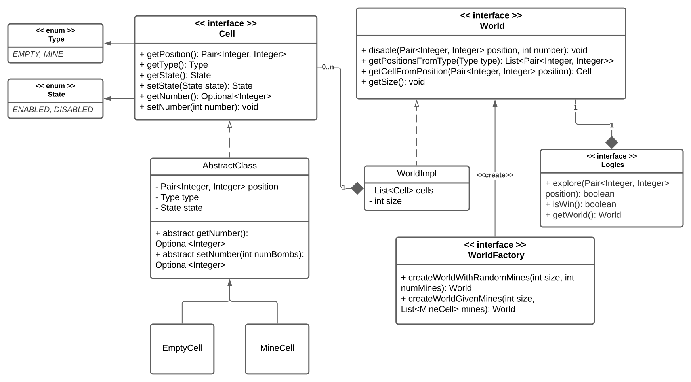

## Exercise 2 Description

The goal of this exercise is to create a GUI with the appearance shown in following image:

Particularly, it implements a clone of the game Minesweeper -
 see [https://minesweeper.online/en/](https://minesweeper.online/en/) for a recap of the game.
 You should implement the game, as follows:
- At the beginning, randomly position a number of mines as indicated as the second argument of the GUI constructor
- Clicking on a cell containing a mine ends the game by showing the positions of the mines
- Clicking on a cell that does NOT contain a mine disables the cell and shows the number of mines in immediate adjacency
  (i.e., in one of the 8 adjacent cells: horizontally, vertically or diagonally)
- If a cell without adjacent mines is clicked,
  all adjacent cells should be "auto-clicked" recursively
  (note that the previous figure shows what happens with an initial click on cell 0,0 in the upper left corner)
- If all cells except the mines are disabled, the application should display a victory message:

A starting codebase is provided,
 that is a minimal GUI already set up to intercept and manage events ([`Main`](./Main.java) it is the entrypoint of the application).

 The goal of this task is to define the methods of the `Logics` interface
 and implement it with a `LogicsImpl` class so that the game works.
General quality objectives and specific ones, as indicated below,
 may lead to additional classes/interfaces of which `LogicsImpl` is composed of or uses.

**DISCLAIMER**: there is a solution with a single `LogicsImpl` class of 80 lines
 (but you should do better!! :) ).

Impeccable TDD should be used.
 Estimated time for the student: 2 to 3 hours.

Finding intermediate and incremental development stages is key! A possible sequence is the following:
1) randomly place the mines
2) at the first click immediately show that the game is lost, displaying the mines
3) if someone clicks on a mine, immediately show that the game is lost by displaying the mines, otherwise allow re-click
4) if someone clicks and does not take the mine, disable the cell
5) if someone clicks and does not take the mine, disable the cell, but also show how many adjacent mines there are
6) if someone clicks and does not take the mine, and there are no adjacent mines, proceed with the auto-clicks
7) manage flag placement with right-click on a cell as in the original game

Note that the above objectives are not for the single red-green-refactor cycle,
 which is generally much shorter.

As quality objectives, take inspiration from the following:
0) Strive for quality in logic, not so much in GUI -
 this is not a general rule, it's just for today's task
1) Try not to violate DRY!
2) If a method is not entirely clear and simple, find a different organization, perhaps by breaking it down into multiple methods
3) If a class violates SRP, divide it into multiple classes (perhaps using patterns such as *Proxy*, *Template Method*, *Strategy*, or mere composition)
4) Do not suffer from "primitive obsession": trying NOT to abuse booleans, integers, and strings. Use ad-hoc types instead!

Architectural suggestions:
1) Model the position of a cell with a `Cell` interface/class, capturing the concepts of adjacency
2) Model the grid with a `Grid` interface/class

# UML Class diagram

